# AWS Cloud SIEM homelab Cloud based Security 

This projects demonstrates the design, deployment, and operation of a cloud-based SIEM solution using Wazuh on AWS. The enviornment simulates a real-world security monitoring deployment, including multi-endpoint log ingestion, host-based intrusion detection, custom detection rule development, and file integrity monitoring (FIM) mapped to the MITRE ATT&CK framework.

## Objectives 
- Deploy a production-style SIEM in a cloud environment
- Collect and analyze security events from multiple operating systems
- Detect and correlate authentication-based attacks
- Implement real-time file integrity monitoring
- Develop and evaluate custom detection rules
- Map detections to MITRE ATT&CK techniques
- Operate within resource-constrained cloud infrastructure

## Architecture 

**SIEM Stack** 
Platform Wazuh 4.7.5 
- (Manger, Indexer, Dashboard)

**Cloud Infrastructure** 
- Provider AWS 
- Service: EC2
- Instance Type: t3.small (2 vCPU, 2GB RAM)
- OS: Ubuntu 22.04 LTS
- Storage: 16GB gp3 EBS

**Monitored Endpoints**
- Ubuntu 22.04 (AWS EC2) -- Self-monitoring enabled 
- macOS Endpoint -- Wazuh agent-based monitoring 

**Detection Framework**
- MITRE ATT&CK

## Use Case Implementations

1. SSH Brute Force Detection 
Scenario:
Simulated repeated SSH authentication failures to evaluate detection and correlation capabilities

**Attack Simulation Script**
[!SSH Bash Script](/brute-force-test.sh)

Generated 15+ failed SSH login attempts

- Observed and analyzed built-in Wazuh rules:

- 5710 – SSH authentication failure

- 5716 – Invalid user authentication attempt

- 5720 – Multiple authentication failures

- 5551 – Brute force attack detected

Developed a custom correlation rule (ID: 100010)

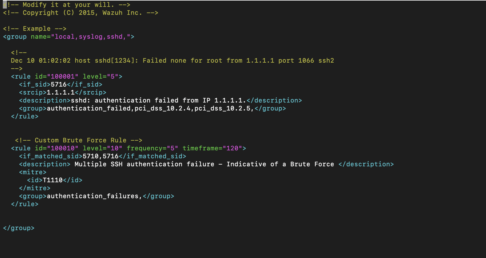
    - MITRE ATT&CK Mapping: T1110 – Brute Force

2. File Integrity Monitoring (FIM)

**Scenario**:
Monitor sensitive directories to detect unauthorized changes.

Monitored Paths:
- /root/critical-files – Database and system configuration files

- /opt/sensitive-data – Simulated API keys and secrets

**Detection Capabilities Tested**:
- File creation
- File modification
- File deletion
- Permission changes

**Results**:
- All changes were detected within seconds
- Alerts included:
    - File hashes (before/after)
    - Permission Changes 
    - User context 
    - Timestamp metadata

### 2. File Integrity Monitoring (FIM)
- Configured real-time monitoring on critical directories
- Monitored: `/root/critical-files` (database configs), `/opt/sensitive-data` (API keys)
- Tested detection of file creation, modification, deletion, and permission changes
- All unauthorized changes detected within seconds with detailed before/after states

## Accomplishments

- Deployed multi-component SIEM in AWS cloud environment 
- Configured agent-based endpoint monitoring across different platforms
- Developed custom detection rules mapped to MITRE ATT&CK framework
- Implemented real-time file integrity monitoring with immediate alerting  
- Analyzed security events and corresponding authentication failures 
- Troubleshooted resource constraints such as memory and disk space within a cloud environment 

## Screenshots 

### AWS EC2 Infrastructure

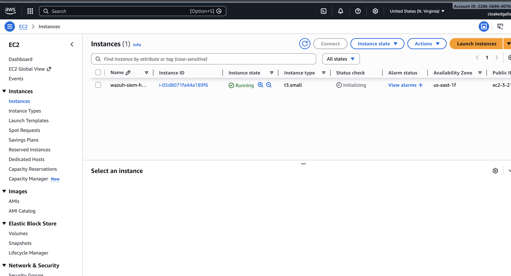
*AWS EC2 instance hosting Wazuh SIEM components*

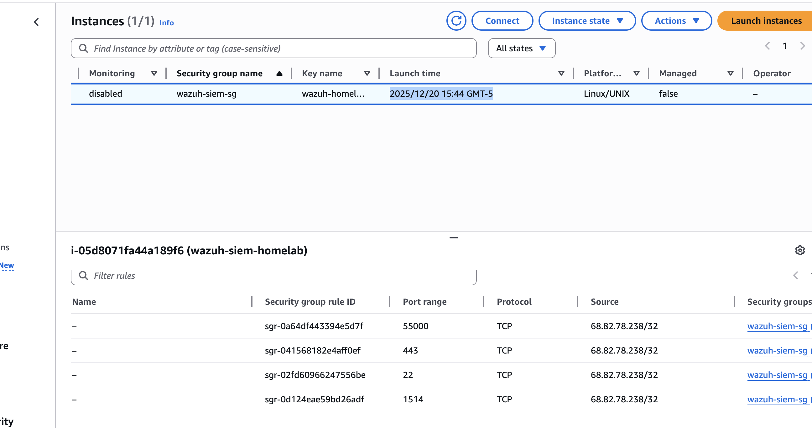
*Security group rules for SIEM access (SSH, HTTPS, Agent communication)*

### Wazuh Installation & Configuration
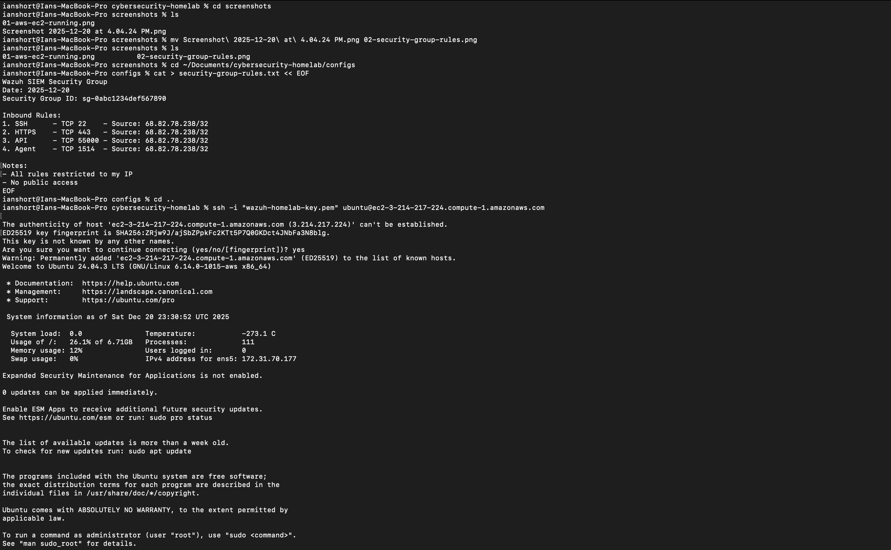
*Successful Wazuh deployment on Ubuntu 22.04*

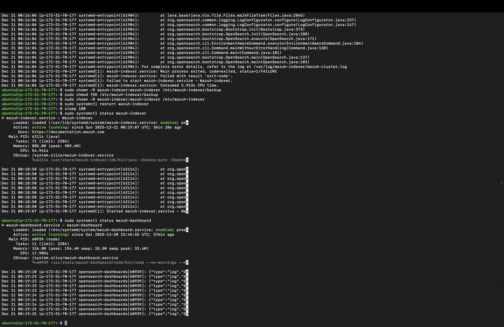
*All Wazuh components active (Manager, Indexer, Dashboard)*

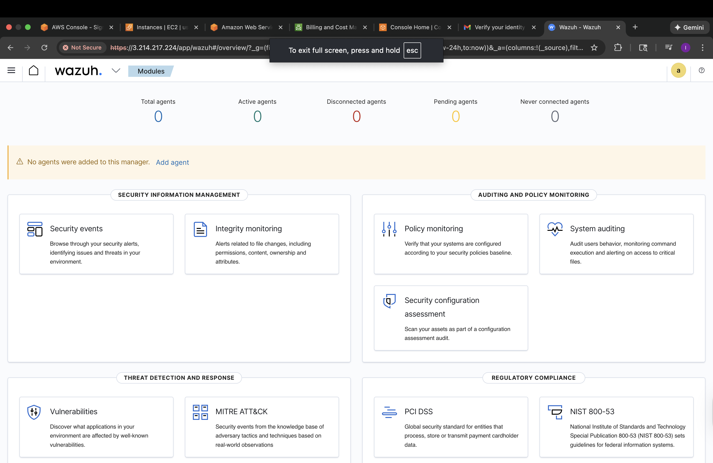
*Wazuh dashboard main interface

### Agent Deployment
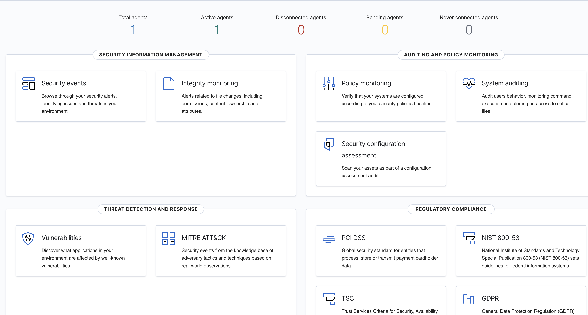
*macOS agent successfully connected to Wazuh Manager*

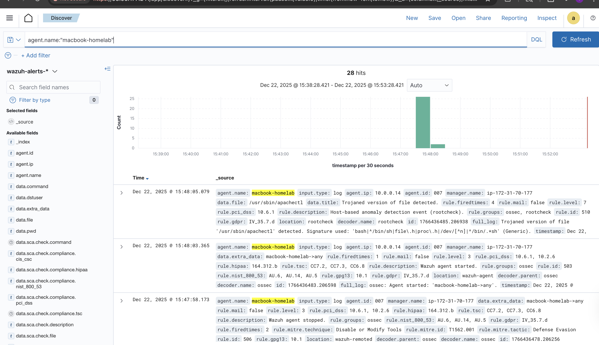
*Real-time security events from monitored endpoints*

### SSH Brute Force Detection
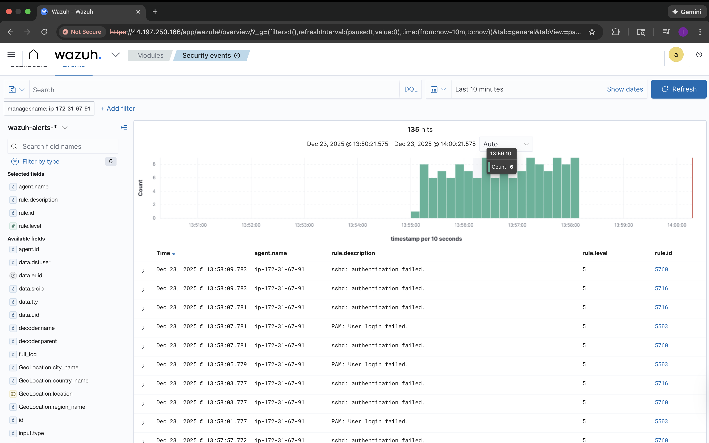
*Individual failed SSH authentication attempts (Rules 5710, 5716)*

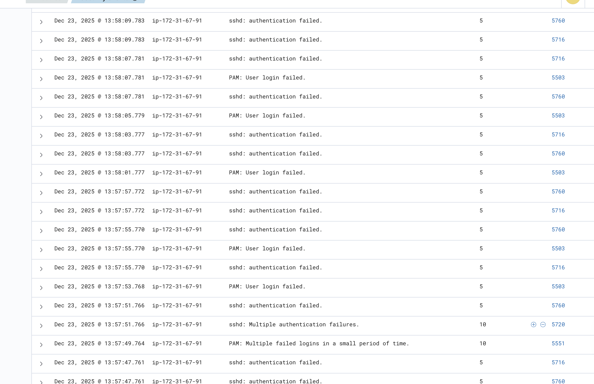
*Built-in correlation rules detecting brute force pattern (Rules 5720, 5551)*

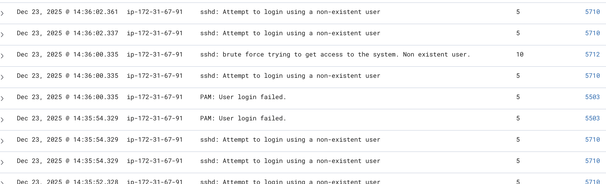
*Wazuh's comprehensive built-in brute force detection capabilities*

## Custom Rule Creation 

*Custom correlation rule (ID: 100010) mapped to MITRE ATT&CK T1110*

### File Integrity Monitoring
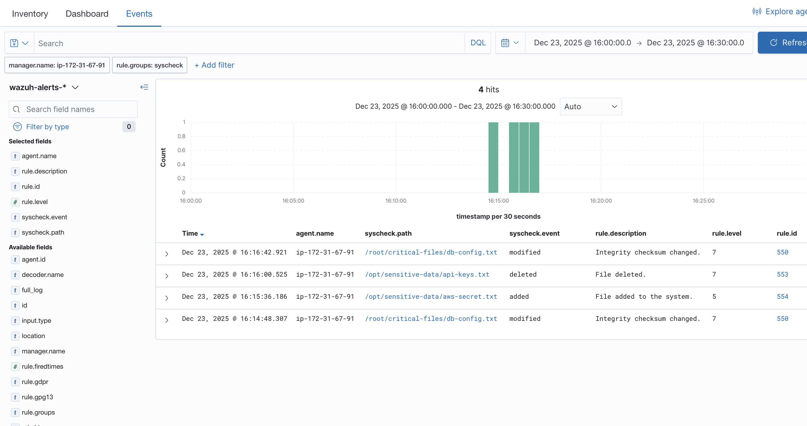
*Real-time file integrity monitoring showing multiple file changes*

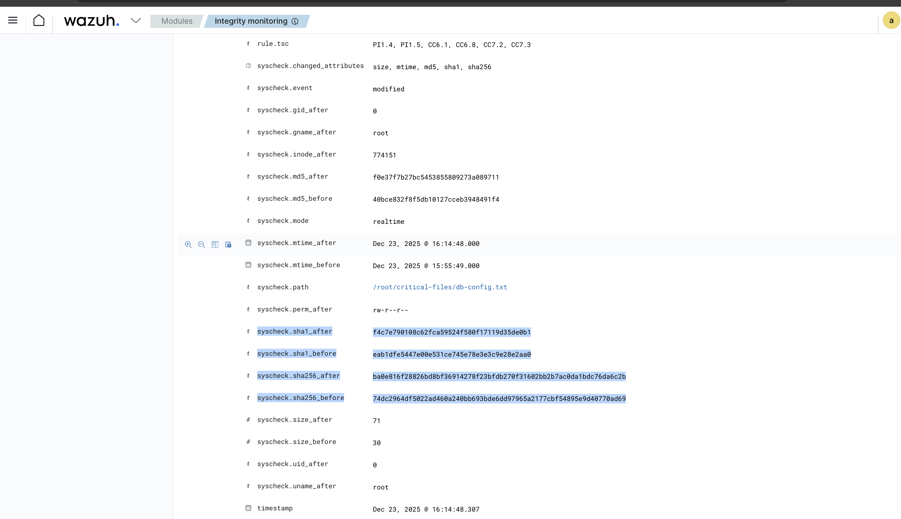
*Detailed FIM alert showing file attributes, hashes, and modification metadata*

## Skills Displayed 

**Technical Skills:**
- Cloud infrastructure deployment (AWS EC2)
- SIEM configuration and administration
- Security event analysis and correlation
- Custom detection rule development
- File integrity monitoring
- Linux system administration
- Network security configuration
- Log analysis and interpretation

**Security Frameworks:**
- MITRE ATT&CK mapping
- Threat detection methodologies
- Security event correlation
- Incident detection and analysis

**Problem-Solving:**
- Resource management under constraints
- Troubleshooting cloud infrastructure issues
- Configuration debugging
- Platform capability analysis

## Main Takeaways

### Platform Comprehension
It it crucial to research and understand the built-in detection logic in Wazuh before creating custom rules. 

### Resource Management 
How to operate SIEM given a resource-limited environment highlighted the importance of 
    - Monitoring disk usage 
    - Optimizing memory consumption
    - Understanding the dependencies of components

## Future Enhancements 

- **Migrate to t3.medium** --  For better performance without the contant resource optimiziation
- **Vulnerability scanning** -- Re-enable vulnerability detection (Disabled due to Ram constraints)
- **Full attack chain scanning** -- initial access -> Privilege escalation -> Data exfiltration
- **Different OS endpoint monitoring** -- Add a Windows server agent to display cross-platform coverage capability

